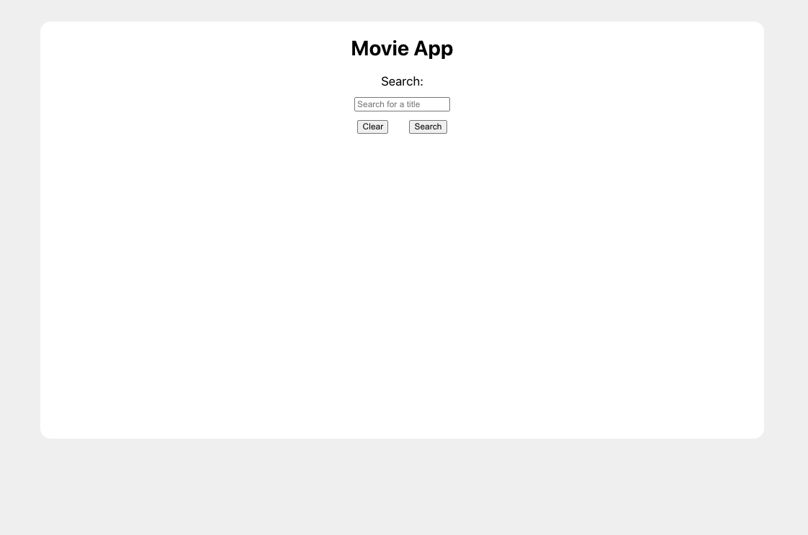
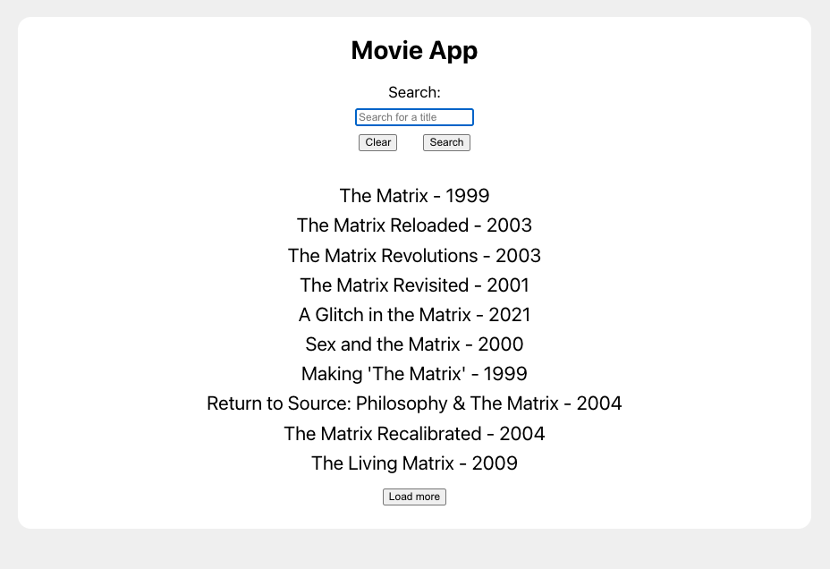
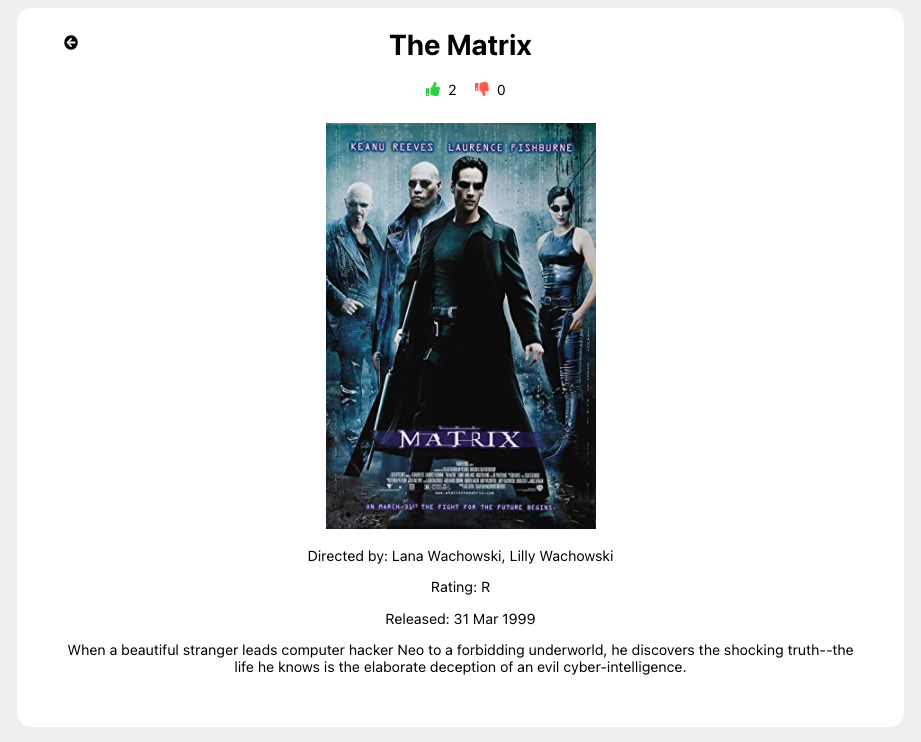

# Movie App - YearOne challenge- Frontend

This portion of the app is a part of a take home challenge for [YearOne](https://www.joinyearone.io/)

## Demo
[Live Demo here](https://right-name.surge.sh/) using [Surge](https://surge.sh/)
[Video Demo on Loom.](https://www.loom.com/share/3626aa052b8944829c9b1aa8a77fd367)

Main Page



Search Results



Movie Details

  
## Run Locally
Please note, this app will make requests to `http://localhost:3001` if the environment variable: `REACT_APP_BASE_URL` is not configured.

In order to run the backend, please see the  [backend repo](https://github.com/brian-trann/yearone-challenge-backend).

Clone the project

```bash
  git clone https://github.com/brian-trann/yearone-challenge-frontend.git
```

Go to the project directory

```bash
  cd yearone-challenge-frontend
```

Install dependencies

```bash
  npm install
```

Start the server

```bash
  npm run start
```

  
## Tech Stack

**Client:** React

**Server:** Node, Express, PostgreSQL

  